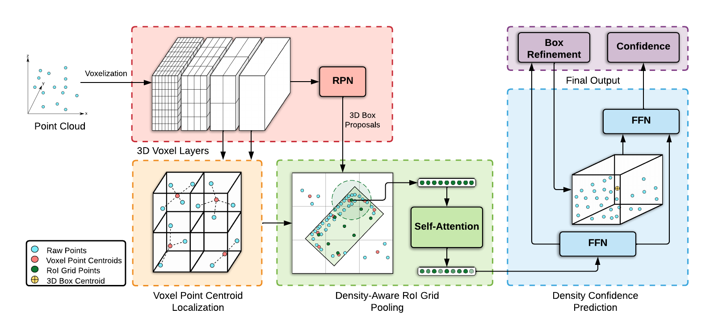

# PDV
PDV is LiDAR 3D object detection method. This repository is based off [`[OpenPCDet]`](https://github.com/open-mmlab/OpenPCDet).

**Point Density-Aware Voxels for LiDAR 3D Object Detection**\
Jordan S. K. Hu, Tianshu Kuai, Steven L. Waslander\
**[[Paper]](https://arxiv.org/abs/2203.05662)**



## Overview
- [Changelog](#changelog)
- [Model Zoo](#model-zoo)
- [Installation](docs/INSTALL.md)
- [Quick Demo](docs/DEMO.md)
- [Getting Started](docs/GETTING_STARTED.md)
- [License](#license)
- [Acknowledgement](#acknowledgement)
- [Citation](#citation)


## Changelog
[2022-03-07] `PDV` v0.1.0 is released.

## Model Zoo

### KITTI 3D Object Detection Baselines
Selected supported methods are shown in the below table. The results are the 3D detection performance of moderate difficulty on the *val* set of KITTI dataset.
* All models are trained with 2 NVIDIA Tesla P100 GPUs and are available for download.
* The training time is measured with 2 NVIDIA Tesla P100 GPUs and PyTorch 1.7.

|                                             | training time | Car@R40 | Pedestrian@R40 | Cyclist@R40  | log | download |
|---------------------------------------------|----------:|:-------:|:-------:|:-------:|:----:|:---------:|
| [PDV](tools/cfgs/kitti_models/pdv.yaml) |~23 hours| 85.05 | 57.41 | 75.95 | [log](https://drive.google.com/file/d/1sZR0fvQUbYd7P8efGvkIv58vY6AZmA5a/view?usp=sharing) | [model-147M](https://drive.google.com/file/d/1b-XGK4gEq7I1GDmsqLQNU4-34qANudKa/view?usp=sharing) |

### Waymo Open Dataset Baselines
We could not provide the above pretrained models due to [Waymo Dataset License Agreement](https://waymo.com/open/terms/),
but you could easily achieve similar performance by training with the default configs. PDV is trained with **10% data (~16k frames)** on 4 NVIDIA Tesla V100s GPUs.


## Installation
Please refer to [INSTALL.md](docs/INSTALL.md) for the installation of `PDV`.


## Quick Demo
Please refer to [DEMO.md](docs/DEMO.md) for a quick demo to test with a pretrained model and
visualize the predicted results on your custom data or the original KITTI data.

## Getting Started
Please refer to [GETTING_STARTED.md](docs/GETTING_STARTED.md) to learn more usage about this project.

## License
`PDV` is released under the [Apache 2.0 license](LICENSE).

## Acknowledgement
We would like to thank the authors of [`OpenPCDet`](https://github.com/open-mmlab/OpenPCDet) for their open source release of their codebase.

## Citation
If you find this project useful in your research, please consider citing:
```
@article{PDV,
    title={Point Density-Aware Voxels for LiDAR 3D Object Detection},
    author={Jordan S. K. Hu and
            Tianshu Kuai and
            Steven L. Waslander},
    journal={CVPR},
    year={2022}
}
```
