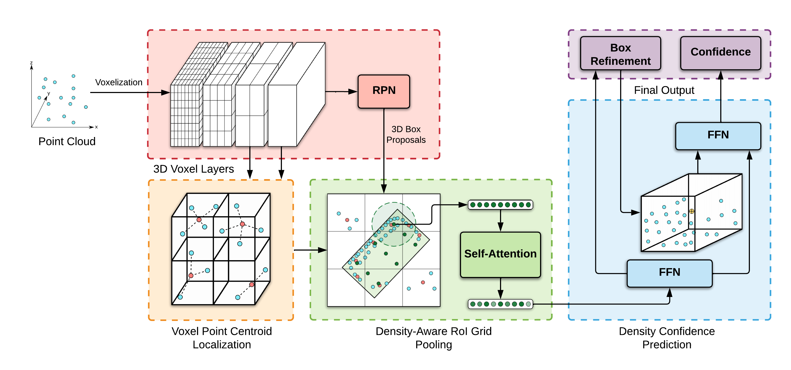

<style>
.row {
  display: flex;
}

/* Create three equal columns that sits next to each other */
.column {
  flex: 33.33%;
  padding: 0px;
}
</style>

## Overview
<p style="text-align:center;">
</p>

## Abstract
LiDAR has become one of the primary 3D object detection sensors in autonomous driving. However, LiDAR's diverging point pattern with increasing distance results in a non-uniform sampled point cloud ill-suited to discretized volumetric feature extraction. Current methods either rely on voxelized point clouds or use inefficient farthest point sampling to mitigate detrimental effects caused by density variation but largely ignore point density as a feature and its predictable relationship with distance from the LiDAR sensor. Our proposed solution, Point Density-Aware Voxel network (PDV), is an end-to-end two stage LiDAR 3D object detection architecture that is designed to account for these point density variations. PDV efficiently localizes voxel features from the 3D sparse convolution backbone through voxel point centroids. The spatially localized voxel features are then aggregated through a density-aware RoI grid pooling module using kernel density estimation (KDE) and self-attention with point density positional encoding. Finally, we exploit LiDAR's point density to distance relationship to refine our final bounding box confidences. PDV outperforms all state-of-the-art methods on the Waymo Open Dataset and achieves competitive results on the KITTI dataset. We provide a code release for PDV which is available [here](https://github.com/TRAILab/PDV).

---
## Paper
**[Point Density-Aware Voxels for LiDAR 3D Object Detection](https://arxiv.org/abs/2203.05662)**\
[Jordan S. K. Hu](https://scholar.google.com/citations?user=aPx2zd8AAAAJ&hl=en), [Tianshu Kuai](https://scholar.google.com/citations?user=mFQ8ICgAAAAJ&hl=en), and [Steven L. Waslander](https://scholar.google.com/citations?user=jY_Bcd8AAAAJ&hl=en)\
CVPR 2022
```
@article{PDV,
    title={Point Density-Aware Voxels for LiDAR 3D Object Detection},
    author={Jordan S. K. Hu and
            Tianshu Kuai and
            Steven L. Waslander},
    journal={CVPR},
    year={2022}
}
```

---
## Affiliations
<div class="row">
  <div class="column">
    <a href="https://robotics.utoronto.ca/">
        
    </a>
  </div>
  <div class="column">
    <a href="https://www.trailab.utias.utoronto.ca/">
        
    </a>
  </div>
</div>
<hr style="height:60px; visibility:hidden;" />
